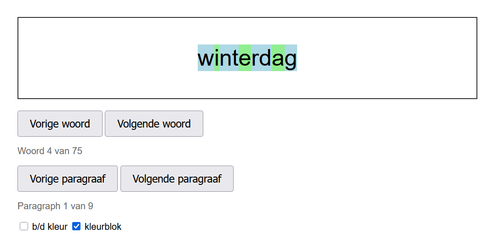
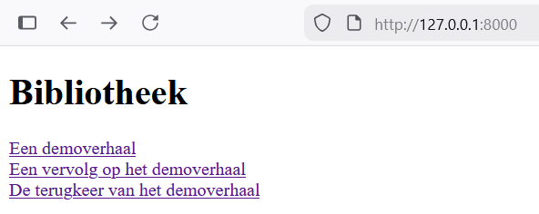

# Reader practice app

## Overview

This is a simple language learning application designed to help practice reading skills in Dutch by focusing on single words. The app is structured in two main components:

- **Backend**: Handles text management and API endpoints. The division of text into syllables happens on the backend
- **Frontend**: Provides the user interface for word-by-word reading exercises including color block for distinguishing letters.

The application focuses specifically on Dutch language learning since this is what I am personally interested in. Using it for other languages would probably require adjustments to both the backend and the frontend.



## Running the app

Running the app involves starting the backend and the frontend on the same machine.

### Backend

For the backend you need to have the [Rust toolchain](https://rust-lang.org/tools/install/) installed. To start the backend run:

```sh
    cargo run -- --texts-path .\demo_texts\
```

This command starts the backend which will read all the texts in JSON format from the `.\demo_texts\` folder. Any other folder path is acceptable. The text files must end with `json` extension and follow the correct schema, which looks like this:

```json
{
    "title": "This is the title",
    "text": ["This is block1", "This is block2"]
}
```

You can put any texts you like to read on this folder and they will be automatically picked up by the backend without needing to restart.

### Frontend

The frontend is only basic HTML+Javascript so you can serve it with any HTTP server. I normally use Python for this:

```sh
    python -m http.server --directory reader_frontend
```

Once both components are running you can simply access the frontend server using your browser. The home page is a list of all the texts available:

